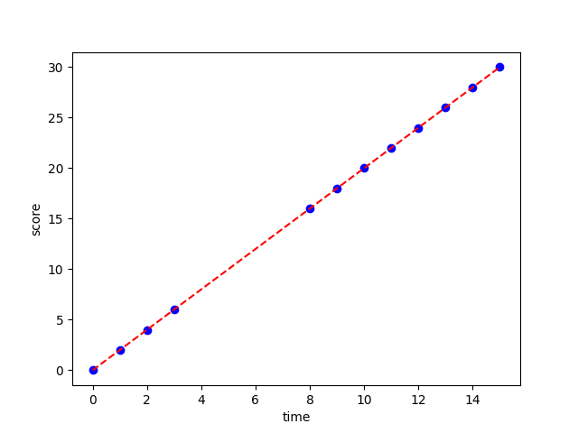
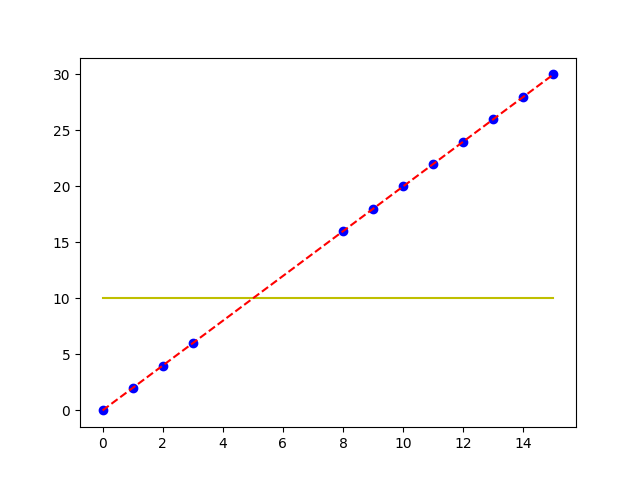
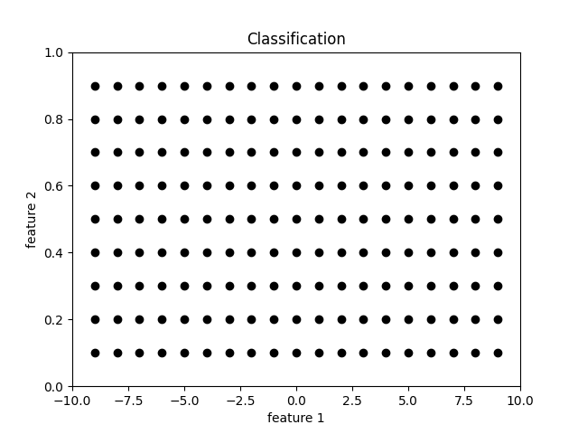
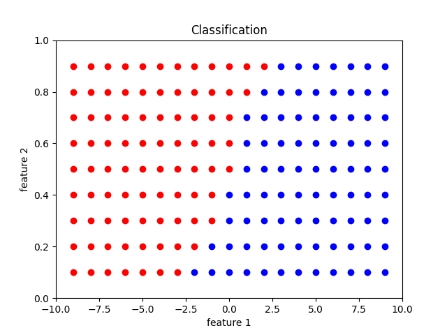
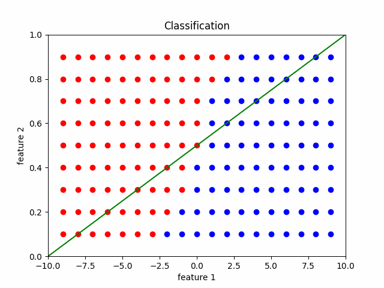
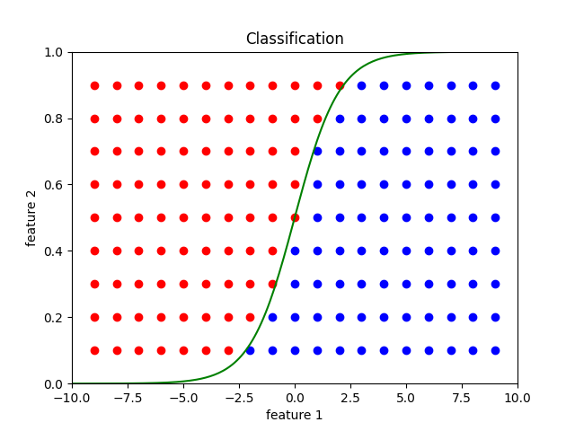

# AI-Seminar-231106

### 4주차 복습
-------
#### Regression, Classification
- Regression 이란?

  여러 개의 독립변수와 한 개의 종속변수 간의 상관관계를 모델링하는 기법

- 데이터

  시간-시험점수 그래프

  

- Regression

  데이터와 최대한 일치하는 함수를 찾아내는 것

  

- Classification

  10점 이상이면 합격 / 10점 미만이면 불합격

  

#### Linear Regression / Logistic Regression(Sigmoid Function)
- 데이터

  x1 = 키 / x2 = 몸무게

  

- 정답(정상/비정상)

  

- Linear Regression

  정상과 비정상을 정확하게 나눌 수 있는 선형함수 y=ax+b를 찾는 과정

  

- Logistic Regression
  정상과 비정상을 정확하게 나눌 수 있는 Sigmoid(y=1/(e^-x+1))를 찾는 과정

  

### 5주차
