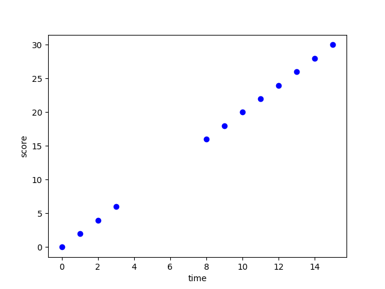
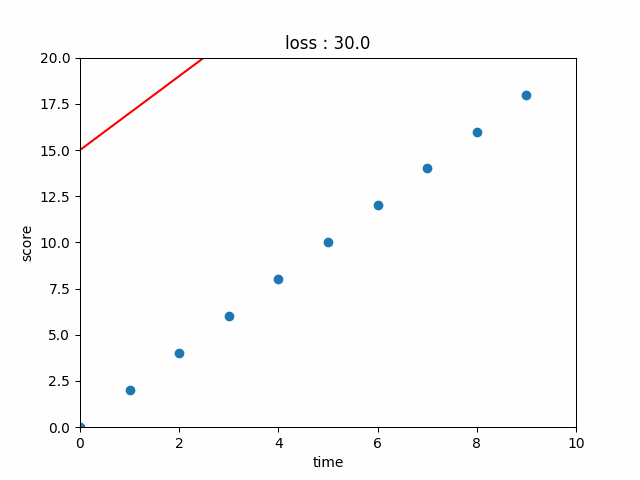

# AI-Seminar-231106

### 4주차 복습
-------
#### Regression, Classification
- Regression 이란?

  여러 개의 독립변수와 한 개의 종속변수 간의 상관관계를 모델링하는 기법

- 데이터

  시간-시험점수 그래프

  

- Regression

  데이터와 최대한 일치하는 함수를 찾아내는 것

  

- Classification

  10점 이상이면 합격 / 10점 미만이면 불합격

  

#### Linear Regression / Logistic Regression(Sigmoid Function)
- 데이터

  x1 = 키 / x2 = 몸무게

  

- 정답(정상/비정상)

  

- Linear Regression

  정상과 비정상을 정확하게 나눌 수 있는 선형함수 x2=ax1+b를 찾는 과정

  

- Logistic Regression
  정상과 비정상을 정확하게 나눌 수 있는 Sigmoid(y=1/(e^-x+1))를 찾는 과정

  

#### Loss
- Loss 란?

  현재 가지고 있는 "데이터의 정답"과 학습한 모델이 출력으로 내뱉는 '예측값' 사이의 다른 정도(절대값, 제곱오차 등...)

  

#### Binary Cross Entropy Loss
- Binary CE Loss 란?
  쉽게 말하면, 정답이 0, 1 이진 분류를 할 때 사용하는 Loss

  

- t = 정답, y_hat = 예측값

  1. t=0일 때, 
      y_hat = 1이라면? loss -> Inf 
      y_hat = 0이라면? loss -> 0 
  2. t=1일 때, 
      y_hat = 0이라면? loss -> Inf 
      y_hat = 1이라면? loss -> 0 
